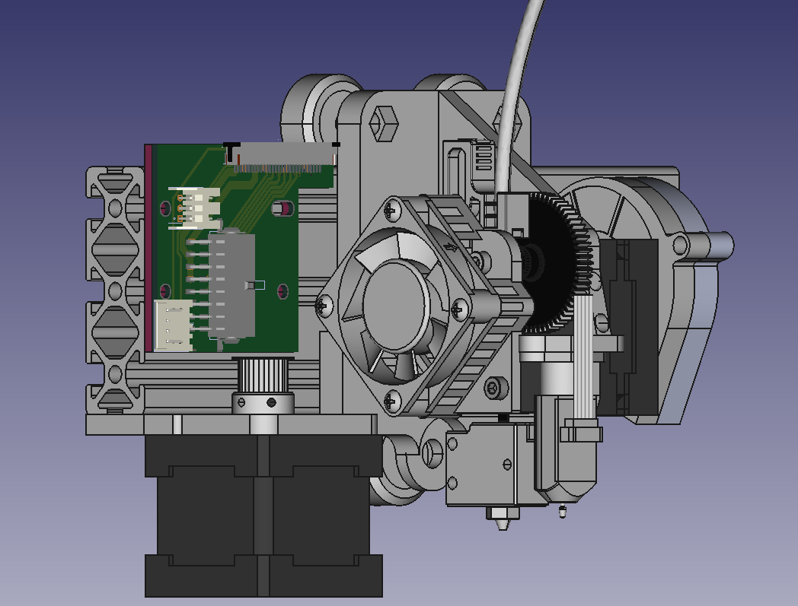
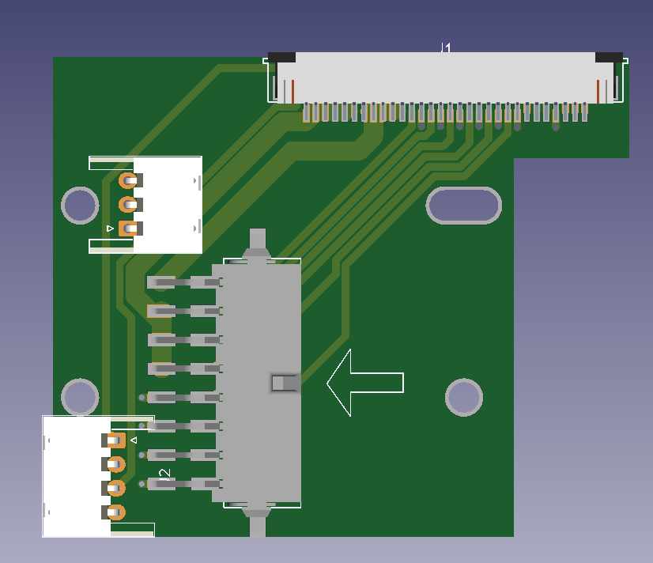
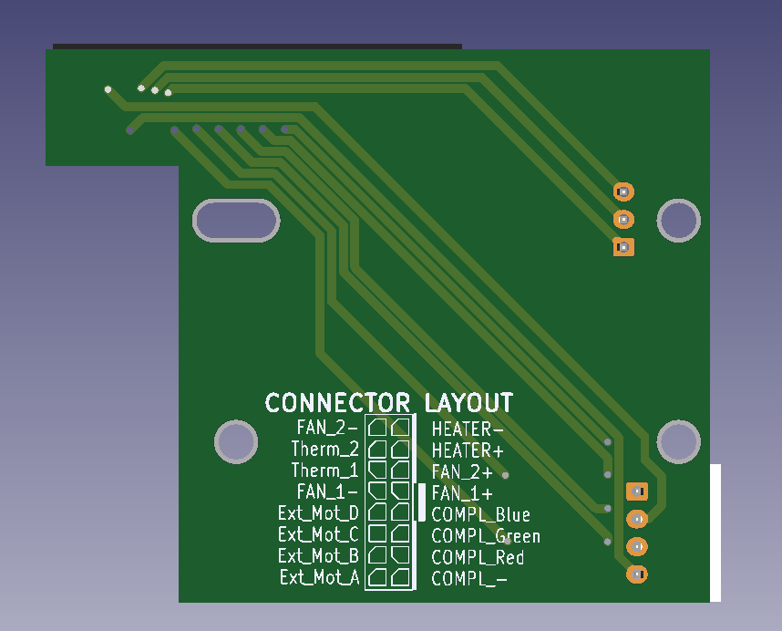

# Sidewinder x1 X axis Gantry and Board

The sidewinder x1 is a great printer but, lacking in some aspects of the X axis.
I have tryed to give the printer a better Head, building an original Titan Aero on the x axis, replacing the x board trying to remove the problems the ribbon cable gave to the printer

I have mounted the Head on the X axis gantry, but I haven't been able to test it, so I can only give you some 3d renderings

